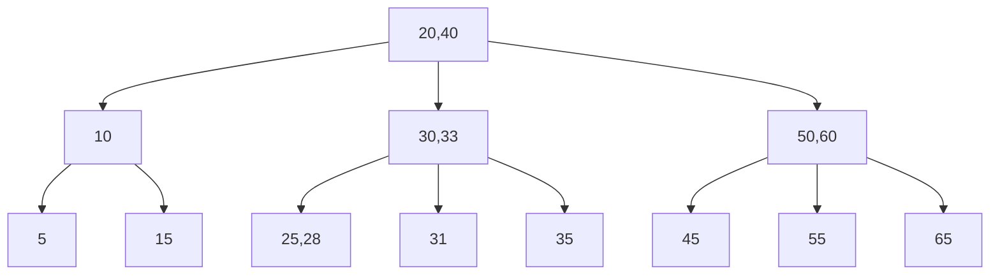

## I. What is Index?
> A data structure is used to locate and fast access data in tables or views

* Help reducing the amount of access to memory during query execution

**-> Increase database query performance.**

* Two types of indexes:
  * Clustered
  * Non-clustered

## II. What is the index database used for?

Example: 
  ```sql
  select * from table_name 
  where column_name = val
  ```
* If there is no index for the `column_name` column, the system will **scan all the rows** of the `table_name` table to search for the row that satisfies condition `column_name = val`

* An index **points to the address** of data in a table (like table of contents in a book)

* Indexes can be created for one or more columns in a table.
  * Create by default for ***primary keys***, ***foreign keys***
  * It is possible to create **additional indexes** for columns if needed

## III. The structure of the index

<center>| <mark style='background-color: #D9F8C4'>Search Key</mark> | <mark style='background-color:#FAD9A1'> Data Reference </mark>| </center>

* ***<span style='color:#D9F8C4'>Search Key</span>***: contains a copy of the indexed column's values
* <span style='color:#FAD9A1'>Data Reference</span>: contains the pointer to the address of the record with the corresponding index column value


## IV. Types of indexes
### B-tree
* The default index type


**Features**:
* Index data is organized and stored in the form of tree (root, branch, leaf)
* The values of nodes **increase from left to right**
* The B-tree index is used in **comparision expressions**: `=`, `>`, `>=`, `<`, `<=`, `BETWEEN`, `LIKE`
**-> Good for `ORDER BY` statement**

* When searching for the node, it starts from the *root node*, and then comes to the *branch* and *leaf*, until all satisfied data are found.

**Syntax**
```sql
--- create index
CREATE INDEX id_index ON table_name
(column_name [, column_name…]) USING BTREE;

ALTER TABLE table_name ADD INDEX id_index
(column_name [, column_name…])

--- delete index
DROP INDEX index_name ON table_name
```

For more details, visit **[here](https://viblo.asia/p/gioi-thieu-ve-b-tree-index-trong-database-ByEZkQn25Q0)**

### Hash
* Based on **Hash function** algorithm.
  * Corresponding to each block of data, index will generate **a bucket key** (also called hash value) to distinguish.


**Features**:
* Hash index should be used only in `=` and `<>` (not equal to operator).
  (*Don't use for operators to find a range of values, like `>` or `<`*)
* The `ORDER BY` is **not optimized** when using Hash index. (can't find the next element in the order)
* Hash is **faster** than B-tree

**Syntax**
```sql
--- create index
CREATE INDEX id_index
ON table_name(column_name [, column_name…]) USING HASH;

ALTER TABLE table_name
ADD INDEX id_index(column_name [, column_name…]) USING HASH;
```
For more details about Hash index, visit **[here](https://viblo.asia/p/hash-index-trong-sql-63vKjwOVZ2R)**

### Storage Engine
* When choosing the index type, it also depends on whether or not the Storage Engine supports the type of index.

|Storage Engine|Supported Index Types|
|:---|:---:|
|InnoDB|Btree|
|MyISAM|Btree|
|MEMORY/HEAP|Hash, Btree|
|NDB|Hash, Btree|

## V. How to use index database effectively?

* **SHOULD INDEX**:
  * The columns used in `WHERE`,`JOIN`,`ORDER BY`

* **SHOULDN'T INDEX**:
  * Small tables, containing little data
  * Tables are updated and inserted data regularly
  * Columns contain so many NULL values
  * Columns are regularly updated

⚠️ _Downside of indexing is that it takes up more memory to store._
